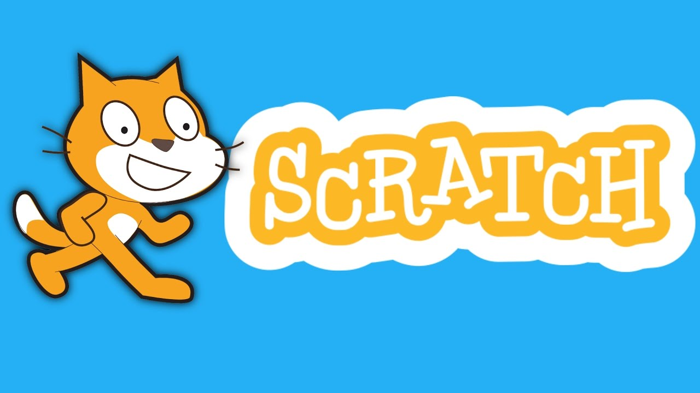
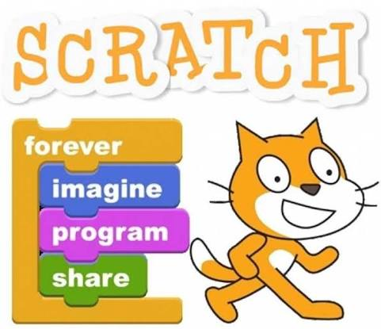
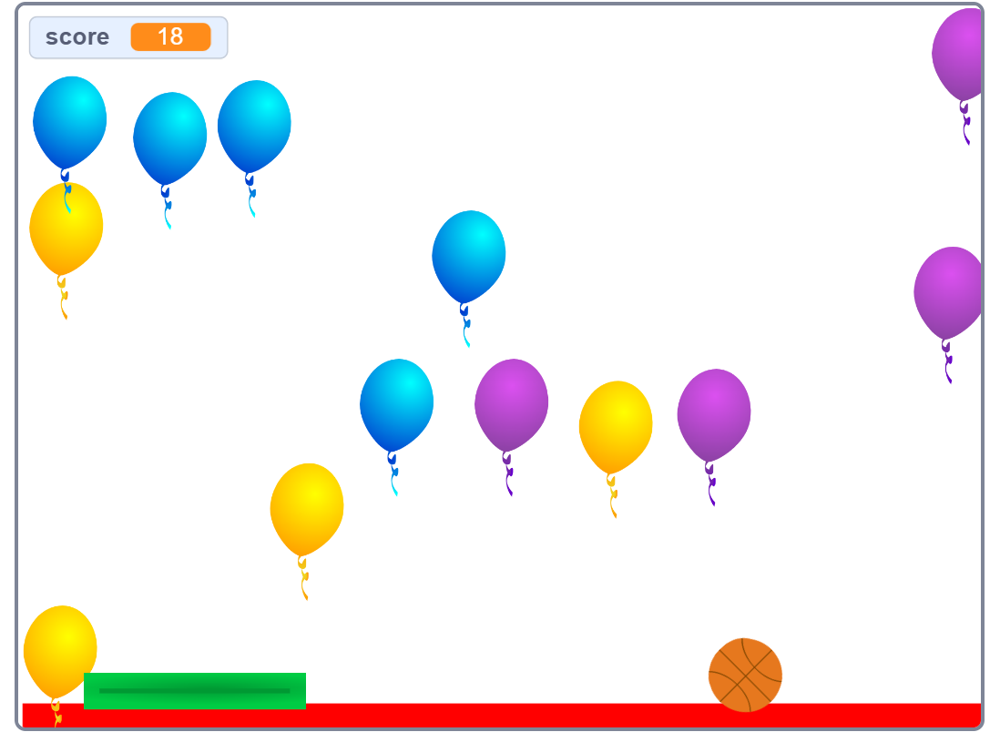

# ✨ SCRATCH ### 💻 Aprende · 🎨 Crea · 🚀 Programa **Aprende programación de una manera fácil, creativa y divertida.**       🎮 PROGRAMACIÓN · 🎨 CREATIVIDAD · 🧠 LÓGICA · 🚀 PROYECTOS 
 --- 
 # 🌟 ¿Qué es Scratch? 
 **Scratch** es una plataforma de programación visual diseñada para aprender de forma **sencilla, creativa y divertida**. En lugar de escribir código complicado, permite programar utilizando **bloques que se conectan como piezas de rompecabezas**. 
 | 🎮 **Juegos** | 🎬 **Animaciones** | 📖 **Historias** | | :----------------------: | :----------------: | :--------------: | | Crea juegos interactivos | Diseña animaciones | Cuenta historias | | 🤖 **Simulaciones** | 💡 **Proyectos** | 🎨 **Creaciones** | | :-------------------: | :------------------: | :--------------------: | | Experimenta con ideas | Desarrolla proyectos | Expresa tu creatividad |    
 --- 
 # 💎 Elementos de Scratch 
 ### 🧩 Bloques principales Los bloques permiten controlar diferentes partes de un proyecto: | 🔵 Movimiento | 🟣 Apariencia | 🔊 Sonido | | :--------------: | :---------------: | :----------------: | | Mover personajes | Cambiar disfraces | Reproducir sonidos | | 🟡 Eventos | 🟠 Control | 🔵 Sensores | | :--------------: | :------------------------: | :------------------: | | Iniciar acciones | Repeticiones y condiciones | Detectar situaciones | | 🟢 Operadores | 🔴 Variables | | :------------------: | :-----------------: | | Realizar operaciones | Guardar información | --- 
 # 🎮 ¿Qué puedes crear? 
 
 | 🎮 Juegos | 🎬 Animaciones | 📖 Historias | | :-----------------: | :-----------------: | :-----------------: | | Juegos interactivos | Personajes animados | Historias digitales | | 🎵 Proyectos musicales | 🤖 Simulaciones | 🌎 Experimentos | | :--------------------: | :-------------------: | :----------------: | | Música y sonidos | Situaciones virtuales | Ideas interactivas | 
 --- 
 # 🧠 ¿Qué aprendes? ### 💻 Programación · 🎨 Creatividad · 🧩 Lógica 
 | 🌟 Habilidad | 📚 Aprendizaje | | :----------------------------- | :------------------------------------------- | | 💻 **Programación** | Comprender conceptos básicos de programación | | 🧠 **Pensamiento lógico** | Resolver problemas paso a paso | | 🎨 **Creatividad** | Crear proyectos originales | | 🧩 **Resolución de problemas** | Encontrar soluciones mediante la lógica | | 🚀 **Innovación** | Transformar ideas en proyectos | --- 
 
 # 💠 Mis aprendizajes            
 --- 
 # 🌊 Ejemplo de proyecto ## 🤿 Aventura Submarina **Un juego donde un submarinista debe recoger objetos, conseguir puntos y evitar enemigos.**       | 🎯 Objetivo | ⭐ Puntuación | ⚠️ Desafío | | :-------------: | :--------------: | :-------------: | | Recoger objetos | Conseguir puntos | Evitar enemigos | 
 --- 
 # 🚀 ¿Por qué aprender Scratch? Scratch permite **aprender haciendo** y convertir las ideas en proyectos interactivos.   ### 💻 Programar Aprende los fundamentos de la programación. ### 🎨 Crear Desarrolla tu imaginación y creatividad. ### 🧠 Pensar Mejora tu lógica y resolución de problemas. ### 🚀 Experimentar Crea, prueba, modifica y vuelve a intentar. --- # ✨ ¡Tu imaginación es el límite! ### 💻 Aprende · 🎨 Crea · 🚀 Programa 

